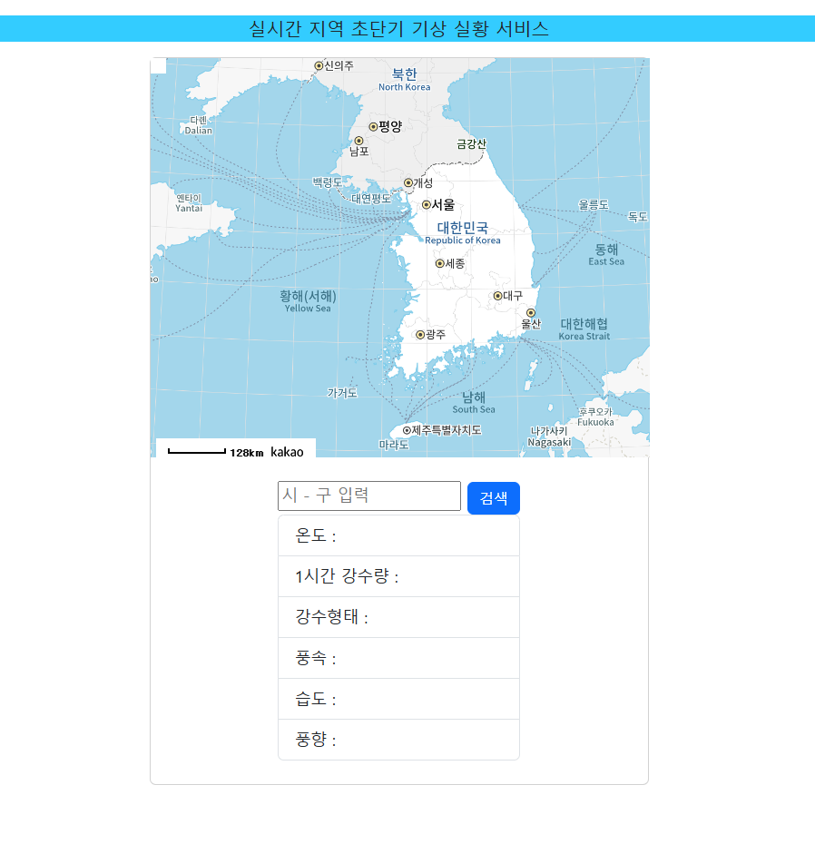
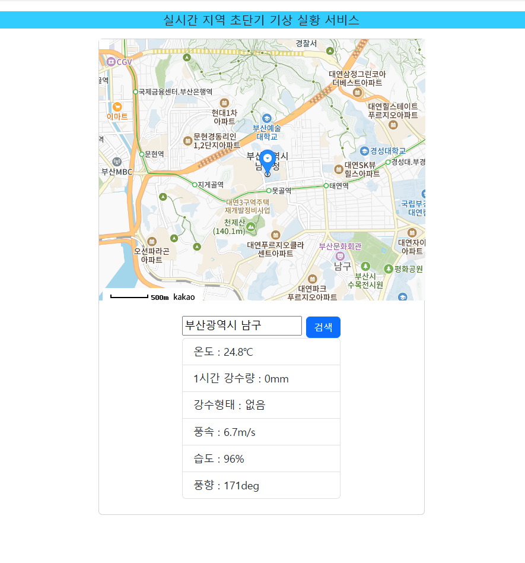

# 실시간 지역 초단기 기상 실황 서비스

## 프로젝트 개요 🌦️

이 프로젝트는 사용자가 원하는 지역의 초단기 기상 실황을 실시간으로 제공하는 웹 애플리케이션입니다. 
사용자는 특정 지역을 검색하거나 지도를 클릭하여 해당 좌표의 기상 정보를 받아볼 수 있습니다.

- **개발 기간**: 2024년 7월 8일 ~ 2024년 7월 18일  
- **사용 기술**: `HTML`, `CSS`, `JavaScript`  
- **주요 기능**:  
  - 사용자가 검색한 지역의 기상 정보를 가져오기  
  - 지도 클릭을 통해 해당 위치의 기상 정보 불러오기  
  - 기상청 데이터를 활용하여 실시간 날씨 정보 제공  

---

## 실행 방법 🚀

1. 프로젝트를 클론합니다.
   ```bash
   git clone https://github.com/사용자이름/저장소이름.git
   ```
2. 로컬 환경에서 `index.html`을 실행합니다.
3. 검색창에 `부산 남구`와 같은 형식으로 입력 후 검색 버튼을 클릭합니다.
4. 이후 지도에서 원하는 위치를 클릭하면 해당 위치의 기상 정보를 확인할 수 있습니다.

---

## 주요 기능 및 동작 방식 ⚡

### 초기 화면 (검색 전)
- 처음 실행하면 대한민국 지도가 표시됩니다.
- 이때 지도 클릭으로는 기상 정보가 불러와지지 않습니다.



### 검색 이후 동작
- 검색창에 시/구 이름을 입력한 후 검색하면 해당 지역의 기상 정보가 표시됩니다.
- 이후부터 지도 클릭 시 클릭한 좌표의 기상 정보가 자동으로 갱신됩니다.



---

## 파일 구조 📁
```plaintext
📂 프로젝트 루트
├── 📂 images              # 프로젝트 관련 이미지 파일
│   ├── initial_screen.png  # 초기 화면
│   ├── search_result.png   # 검색 후 동작 화면
├── index.html              # 메인 HTML 파일
├── style.css               # 스타일 시트
├── script.js               # JavaScript 코드
└── README.md               # 프로젝트 설명서
```

---

## 기여 방법 🤝
1. 이 프로젝트를 포크합니다.
2. 새로운 기능을 추가하거나 버그를 수정한 후 커밋합니다.
3. Pull Request를 생성합니다.

---

